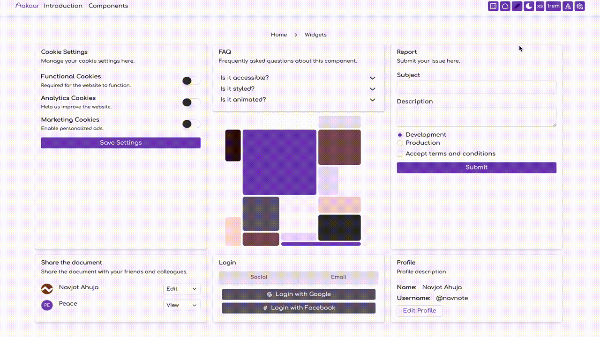

<p align="center">
  
</p>

<p align="center">
  <span>Aakaar UI Framework</span>
</p>

<p align="center">
  <a href="https://github.com/navnote/aakaar/actions/workflows/ci.yml">
    
  </a>
</p>

<p align="center">
  <a href="https://aakaar.navnote.com">aakaar.navnote.com</a>
</p>



Aakaar is a modern, customizable component library built on top of Tailwind CSS, offering a similar developer experience to shadcn/ui but with enhanced customization capabilities. It provides beautifully designed, accessible React components that you can copy and paste into your apps and fully customize to match your design needs. Built with TypeScript and modern best practices, Aakaar gives you complete control over styling while maintaining a consistent design system.

## ✨ Features

- 🎨 **Modern Design**: Built with Tailwind CSS for clean, accessible, and responsive components
- 🎯 **TypeScript First**: Full TypeScript support with comprehensive type definitions
- 🚀 **Performance Optimized**: Leverages Tailwind's utility-first approach for optimal performance
- 🎭 **Customizable**: Easy theming through Tailwind configuration and CSS variables
- 🔧 **Developer Experience**: Comprehensive documentation and examples
- 🎁 **Zero-Config**: Works seamlessly with Tailwind CSS out of the box

## 🚀 Quick Start

## For a new vite project

```bash
pnpx @aakaar/cli setup
```

### Install dependencies

```bash
pnpm add -D tailwindcss @tailwindcss/vite class-variance-authority clsx tailwind-merge
```

### Update vite.config.ts file

```js
import { defineConfig } from "vite";
import react from "@vitejs/plugin-react-swc";
import tailwindcss from "@tailwindcss/vite";
// https://vite.dev/config/
export default defineConfig({
  plugins: [react(), tailwindcss()],
});
```

### Create tokens

```bash
pnpx @aakaar/cli token # Change the tokens.color in aakaar.json file if you want to change color theme
```

### Update stylesheet

```bash
rm src/App.css
```

### Import token with tailwind css

```css
/* src/index.css */
@import "tailwindcss";
@import "design/css/tokens.css";

@source "../";
```

### Add components to your project

```bash
pnpx @aakaar/cli add card
pnpx @aakaar/cli add button
```

### Finally App.tsx file

```tsx
import { useState } from "react";
import {
  Card,
  CardContent,
  CardDescription,
  CardHeader,
  CardTitle,
} from "./design/components/card/card";
import { Button } from "./design/components/button/button";

export default function App() {
  const [count, setCount] = useState(0);

  return (
    <div className="bg-background text-on-background h-screen w-screen p-xl">
      <Card className="md:w-1/3 mx-auto">
        <CardHeader>
          <CardTitle>Vite + React + Aakaar</CardTitle>
          <CardDescription>
            Aakaar is a design system for building web applications.
          </CardDescription>
        </CardHeader>
        <CardContent>
          <Button onClick={() => setCount((count) => count + 1)}>
            count is {count}
          </Button>
        </CardContent>
      </Card>
    </div>
  );
}
```

## For existing project

* Run `pnpx @aakaar/cli setup` to initialize aakaar in your project.
* Run `pnpm add -D tailwindcss @tailwindcss/vite class-variance-authority clsx tailwind-merge` to install dependencies.
* Run `pnpx @aakaar/cli token` to generate a new tokens.css file.
* Run `pnpx @aakaar/cli add card` card component. Or other components you see on [aakaar](https://aakaar.navnote.com).

🎉 You are all set to go! You can now start building your application with Aakaar! 🚀


## 🎨 Theming

Aakaar provides a flexible theming system that allows you to customize the look and feel of your application.
We use Google's Material Design 3 tokens to create a consistent and beautiful design system for colors.

* You can update aakaar.json file to generate a new tokens.css file. Then run `pnpx @aakaar/cli token` to generate a new tokens.css file.
* Change the `--base` value to have a different base size for the design system.

### Example tokens.css file

```css
@theme {
  /* Category: Reset Colors */
  --color-*: initial;

  /* Category: Primary Colors */
  --color-primary-0: oklch(0% 0 none);
  --color-primary-10: oklch(23% 0.08 35);
  --color-primary-20: oklch(32% 0.11 35);
  --color-primary-30: oklch(41% 0.14 35);
  --color-primary-40: oklch(50% 0.17 35);
  --color-primary-50: oklch(59% 0.18 36);
  --color-primary-60: oklch(68% 0.19 36);
  --color-primary-70: oklch(76% 0.15 36);
  --color-primary-80: oklch(84% 0.09 35);
  --color-primary-90: oklch(92% 0.04 36);
  --color-primary-95: oklch(96% 0.02 33);
  --color-primary-100: oklch(100% 0 none);
  --white: #fff;
  --black: #000;

  /* Category: Pallete Colors */
  --color-primary: light-dark(oklch(50% 0.17 35), oklch(84% 0.09 35));
  --color-on-primary: light-dark(oklch(100% 0 none), oklch(32% 0.11 35));
  --color-primary-container: light-dark(oklch(92% 0.04 36), oklch(41% 0.14 35));
  --color-on-primary-container: light-dark(oklch(23% 0.08 35), oklch(92% 0.04 36));
  --color-secondary: light-dark(oklch(49% 0.05 36), oklch(83% 0.05 34));
  --color-on-secondary: light-dark(oklch(100% 0 none), oklch(32% 0.04 36));
  --color-secondary-container: light-dark(oklch(92% 0.04 36), oklch(40% 0.04 36));
  --color-on-secondary-container: light-dark(oklch(23% 0.04 36), oklch(92% 0.04 36));
  --color-tertiary: light-dark(oklch(48% 0.07 92), oklch(83% 0.08 91));
  --color-on-tertiary: light-dark(oklch(100% 0 none), oklch(31% 0.06 92));
  --color-tertiary-container: light-dark(oklch(91% 0.08 91), oklch(40% 0.06 93));
  --color-on-tertiary-container: light-dark(oklch(23% 0.05 94), oklch(91% 0.08 91));
  --color-error: light-dark(oklch(51% 0.19 28), oklch(84% 0.09 27));
  --color-on-error: light-dark(oklch(100% 0 none), oklch(33% 0.13 27));
  --color-error-container: light-dark(oklch(92% 0.04 25), oklch(42% 0.17 27));
  --color-on-error-container: light-dark(oklch(24% 0.1 27), oklch(84% 0.09 27));
  --color-background: light-dark(oklch(99% 0.01 330), oklch(22% 0.01 29));
  --color-on-background: light-dark(oklch(22% 0.01 29), oklch(92% 0.01 33));
  --color-surface: light-dark(oklch(99% 0.01 330), oklch(22% 0.01 29));
  --color-on-surface: light-dark(oklch(22% 0.01 29), oklch(92% 0.01 33));
  --color-surface-variant: light-dark(oklch(92% 0.03 32), oklch(40% 0.02 34));
  --color-on-surface-variant: light-dark(oklch(40% 0.02 34), oklch(83% 0.03 36));
  --color-outline: light-dark(oklch(57% 0.02 33), oklch(66% 0.02 31));
  --color-outline-variant: light-dark(oklch(83% 0.03 36), oklch(40% 0.02 34));
  --color-shadow: light-dark(oklch(0% 0 none), oklch(0% 0 none));
  --color-scrim: light-dark(oklch(0% 0 none), oklch(0% 0 none));
  --color-inverse-surface: light-dark(oklch(31% 0.01 36), oklch(92% 0.01 33));
  --color-inverse-on-surface: light-dark(oklch(96% 0.01 33), oklch(31% 0.01 36));
  --color-inverse-primary: light-dark(oklch(84% 0.09 35), oklch(50% 0.17 35));

  /* Category: Scale */
  --scale: 1;

  /* Category: Base */
  --base: 1rem;

  /* Category: Reset spacing */
  --spacing-*: initial;

  /* Category: Spacing */
  --spacing-0: 0;
  --spacing-xs: calc(var(--scale) * var(--base) * 0.25);
  --spacing-sm: calc(var(--scale) * var(--base) * 0.5);
  --spacing-md: calc(var(--scale) * var(--base) * 1);
  --spacing-lg: calc(var(--scale) * var(--base) * 1.5);
  --spacing-xl: calc(var(--scale) * var(--base) * 2);
  --spacing-full: 100%;

  /* Category: FontSize */
  --font-size-xs: calc(var(--scale) * var(--base) * 0.75);
  --font-size-sm: calc(var(--scale) * var(--base) * 0.875);
  --font-size-md: calc(var(--scale) * var(--base) * 1);
  --font-size-lg: calc(var(--scale) * var(--base) * 1.25);
  --font-size-xl: calc(var(--scale) * var(--base) * 1.5);

  /* Category: BorderRadius */
  --radius-0: 0;
  --radius-xs: calc(var(--scale) * var(--base) * 0.25);
  --radius-sm: calc(var(--scale) * var(--base) * 0.375);
  --radius-md: calc(var(--scale) * var(--base) * 0.5);
  --radius-lg: calc(var(--scale) * var(--base) * 0.75);
  --radius-xl: calc(var(--scale) * var(--base) * 1);
  --radius-full: calc(var(--scale) * var(--base) * 999);
  --radius-default: var(--radius-md);

  /* Category: Shadows */
  --shadow-0: none;
  --shadow-xs: 0 1px 2px 0 rgb(0 0 0 / 0.05);
  --shadow-sm: 0 4px 6px -1px rgb(0 0 0 / 0.1), 0 2px 4px -2px rgb(0 0 0 / 0.1);
  --shadow-md: 0 10px 15px -3px rgb(0 0 0 / 0.1), 0 4px 6px -4px rgb(0 0 0 / 0.1);
  --shadow-lg: 0 20px 25px -5px rgb(0 0 0 / 0.1), 0 8px 10px -6px rgb(0 0 0 / 0.1);
  --shadow-xl: 0 25px 50px -12px rgb(0 0 0 / 0.25);
  --shadow-full: 0 0 0 100vh rgba(0, 0, 0, 0.5);

  /* Category: Drop Shadows */
  --drop-shadow-0: none;
  --drop-shadow-xs: 0 1px 1px rgb(0 0 0 / 0.05);
  --drop-shadow-sm: 0 1px 2px rgb(0 0 0 / 0.15);
  --drop-shadow-md: 0 3px 3px rgb(0 0 0 / 0.12);
  --drop-shadow-lg: 0 4px 4px rgb(0 0 0 / 0.15);
  --drop-shadow-xl: 0 9px 7px rgb(0 0 0 / 0.1);
  --drop-shadow-full: 0 25px 25px rgb(0 0 0 / 0.15);

  /* Category: Inset Shadows */
  --inset-shadow-0: none;
  --inset-shadow-xs: inset 0 1px 2px 0 rgb(0 0 0 / 0.05);
  --inset-shadow-sm: inset 0 4px 6px -1px rgb(0 0 0 / 0.1), inset 0 2px 4px -2px rgb(0 0 0 / 0.1);
  --inset-shadow-md: inset 0 10px 15px -3px rgb(0 0 0 / 0.1), inset 0 4px 6px -4px rgb(0 0 0 / 0.1);
  --inset-shadow-lg: inset 0 20px 25px -5px rgb(0 0 0 / 0.1), inset 0 8px 10px -6px rgb(0 0 0 / 0.1);
  --inset-shadow-xl: inset 0 25px 50px -12px rgb(0 0 0 / 0.25);
  --inset-shadow-full: inset 0 0 0 100vh rgba(0, 0, 0, 0.5);

}
```